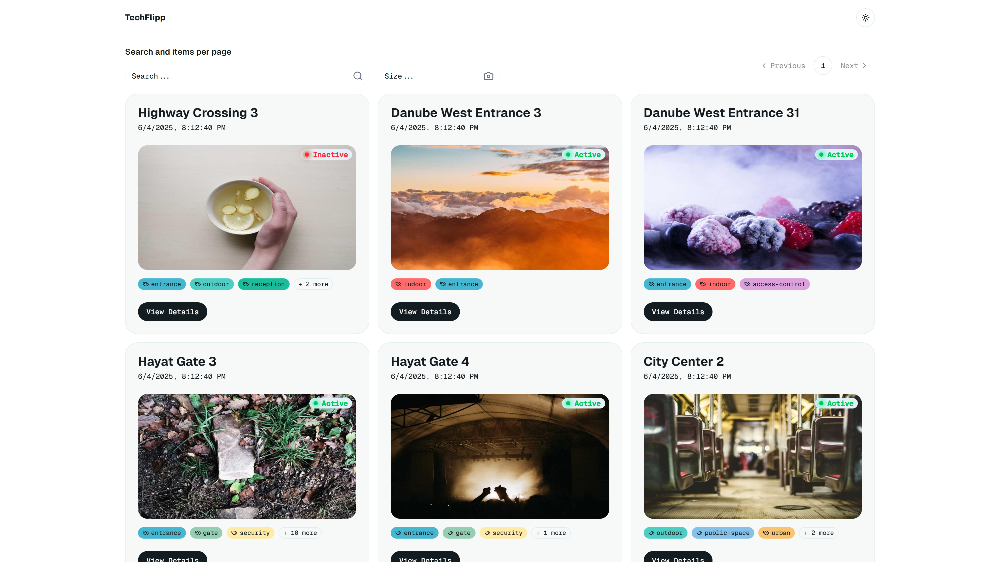
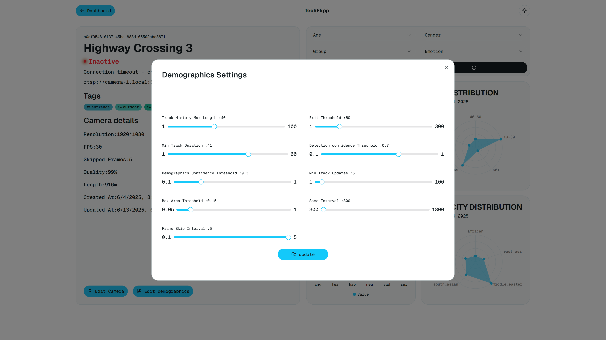

# TechFlipp Frontend Task — Camera Management Dashboard

A camera management dashboard built with Next.js 15 (App Router), Tailwind CSS v4, React Query, Axios, React Hook Form, Zod, and ShadCN UI components.

## 📦 Setup Instructions

1. **Clone the repo**

```bash
git clone https://github.com/MhassanAv/hiring-task-dashboard-451.git
cd hiring-task-dashboard-451
```

2. **Install dependencies**

```bash
yarn install
```

3. **Run development server**

```bash
yarn dev
```

4. **Open your browser**

Navigate to <http://localhost:3000>

5. **API Base URL**

Uses a public API: <https://task-451-api.ryd.wafaicloud.com>

## 🚀 Overview of Implementation

- Uses the Next.js 15 App Router with the app/ directory for routing and layouts.

- Sidebar component contains search input and size input for filtering cameras.

- Cameras page fetches and displays paginated camera data using React Query + Axios.

- Camera details and edit forms implemented using modals with prefetching.

- Forms use React Hook Form with Zod for validation and schema-based type safety.

- Modern Animations using framer-motion to improve the UX.

- Smooth Scrolling functionality using Lenis.

- Tag selection supports multi-select with toggling logic and synchronizes with form state.

- Controlled components used for sliders (ShadCN UI) integrated with form.

- Error and success feedback handled via Sonner toast notifications.

- Tailwind CSS v4 for styling with conditional classes based on data state.

- Skeleton loaders and loading indicators to improve UX during async data fetches.

- Pagination and search are controlled via URL query parameters for easy sharing and navigation.

- No global state library used; React Query handles all server state and caching.

## 💡 Assumptions and Design Decisions

- the UI is fully responsive as modern dashboard should be,the integrated sidebar and filtering functionalities makes it the UI/UX much better.

- As a Dashboard, I developed it to be an SPA (Single Page Application),I thought their is no need for SSR or ISR and leveraged the power of client side rendering to not make things feel slow, The SEO isn't a concern for this kind of projects but I took care of it to maximize the potential.

## 📷 Screenshots

### Cameras Home Page



### Camera Details


### Camera Edit mode


### Demographics Details & Edit mode



### Home Page Mobile


## ✅ Completed Requirements

### ✅ 1. Camera List Page

- ✅ Implement a paginated view of cameras
- ✅ Allow users to control how many items appear per page
- ✅ Provide a way to search for cameras by name
- ✅ Display relevant camera information in a user-friendly manner

### ✅ 2. Camera Detail Page

- ✅ Create a view showing comprehensive camera information
- ✅Design an intuitive layout for camera details

### ✅ 3. Camera Update Functionality

- ✅ Develop a user interface for updating camera details
- ✅ Implement appropriate validation with meaningful feedback
- ✅ Consider the user experience during form submission

### ✅ 4. Demographics Configuration

- ✅ Enable users to create or edit demographics configuration for cameras - one to one relationship with camera
- ✅ Design form controls appropriate for each configuration parameter
- ✅ Ensure proper validation of configuration values

### ✅ 5. Demographics Results & Analytics

- ❌ Implement filtering capabilities for the data
- ✅ Create informative visualizations that convey demographic insights like charts, graphs, tables, etc.

## ✅ Completed Nice-to-Have Technical Features

- ✅ Different rendering ways as needed (SSR, ISR, SSG, etc.)
- ✅ Skeleton loading states to improve perceived performance
- ✅ Seamless data refresh mechanisms
- ✅ Render error messages in form fields
- ✅ Optimistic UI updates for a better user experience
- ✅ Organized state management
- ✅ Use React Query (TanStack Query) for fetching and caching data.
- ✅ Creative and intuitive UI/UX design
- ✅ SEO and performance optimizations
- ❌ Unit tests for key components
